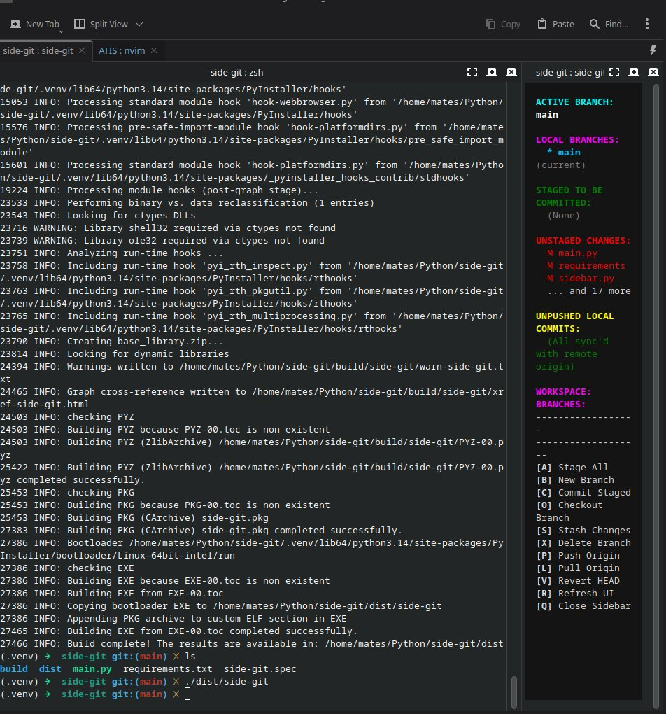
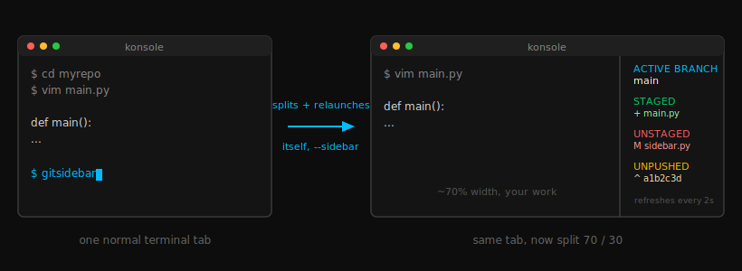

# side-git

A small, always-on git status panel for KDE Konsole. Run it from inside a repo and it splits your Konsole tab, dropping a live-updating branch/staged/unstaged/unpushed view into the new pane, with one-key actions for the things you do most.



## How it works

Run it once, while sitting in a normal Konsole tab inside a git repo. It splits the window 70/30 via Konsole's D-Bus interface and relaunches itself in the new pane to show the status panel. If that's not possible for any reason — you're not in Konsole, `qdbus` isn't installed, the D-Bus call gets rejected — it just runs the panel in your current pane instead of doing nothing.



The panel refreshes on its own every couple of seconds, so it stays current as you edit and commit from the other pane.

## Features

The active branch and full local branch list sit at the top, followed by staged changes, unstaged changes, and unpushed commits, each labeled with the real git change type (`M`, `A`, `D`, `R`, `T`) rather than a generic marker. The status list scrolls if it's longer than the pane. Creating a new branch automatically pushes it and sets the upstream tracking, so there's no follow-up `git push --set-upstream` needed. Everything ships as one self-contained binary with no separate Python install or virtualenv required on the machine that runs it.

## Requirements

Running the binary needs `git` on your `PATH`, since the underlying GitPython library shells out to it rather than reimplementing git itself. The auto-split behavior additionally needs `qdbus`, `qdbus6`, or `qdbus-qt6` (commonly packaged as `qt6-tools` or `qttools`) and an actual Konsole session — without either, gitsidebar still runs, just without the split.

Building from source needs Python 3.10+ along with `textual`, `gitpython`, and `pyinstaller`.

## Building

```bash
pip install textual gitpython pyinstaller
pyinstaller --onefile --name side-git side-git.py
```

This produces `dist/side-git`, a single executable. Copy it somewhere on your `PATH`, e.g. `~/.local/bin/`, and run `side-git` from any repo.

A caveat worth knowing: PyInstaller links against the `glibc` of whatever machine builds it, and the resulting binary won't run on a system with an older `glibc` than the build machine's (newer is fine). If you want one binary that genuinely runs across several machines, build it on the oldest distro you intend to target, or inside a container pinned to an old base image.

## Usage

From inside a Konsole tab, in any git repository:

```bash
side-git
```

### Keybindings

| Key | Action |
| --- | --- |
| `A` | Stage all changes |
| `C` | Commit staged changes (prompts for a message) |
| `S` | Stash changes |
| `P` | Push to origin |
| `L` | Pull from origin |
| `V` | Revert the last commit |
| `B` | Create a new branch, switch to it, and push with `--set-upstream` |
| `O` | Checkout an existing branch |
| `X` | Delete a local branch |
| `R` | Refresh the panel manually (it also refreshes automatically) |
| `Q` | Quit |

## Known limitations

The auto-split only works inside Konsole; other terminal emulators just run the panel in the current pane. Konsole's `runCommand`/`sendText` D-Bus methods are flagged as security-sensitive and can be disabled in some configurations, in which case the split will silently fall back to running in place — any failure there gets printed to stderr if you want to debug it. And as noted above, the compiled binary isn't portable to systems with an older glibc than the one it was built on.
